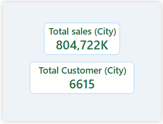

# Retail Sales Analysis 

## Project Overview

This project presents a Retail Sales Analysis Dashboard built using Power BI to analyze sales performance, customer behavior, and product trends. The dashboard provides clear and interactive insights through KPIs, charts, and filters, enabling better business decision-making.

## Key Features
  * KPI Metrics
  * Sales by Category
  * Top 5 Products
  * Revenue by City
  * Tooltip showing Sales & Customer Count
  * Date slicer (range-based)
  * Category & City filters
  * Tooltip page for quick insights

## Tools & Technologies
* Power BI
* Excel (Data Cleaning)
* PostgreSQL (Data Validation & Analysis)

## Key Insights
* High revenue generated from premium product categories
* Certain cities contribute significantly to overall sales
* Seasonal trends visible in monthly sales performance
* Top products drive a large portion of revenue

## Files
* Dataset: [HR_Attrition_Cleaned.xlsx](HR_Attrition_Cleaned.xlsx)
* Power BI File: [hr-attrition.pbix](hr-attrition.pbix)
* SQL File: [Retail_sales.sql](Retail_sales.sql)

## What I Learned
* Data cleaning and validation using Excel & SQL
* Building interactive dashboards in Power BI
* Implementing tooltip feature
* Designing user-friendly and professional layouts

## 📷 Dashboard Preview

## Project Highlights
* Interactive dashboard
* Advanced analytics features
* Clean and professional UI
